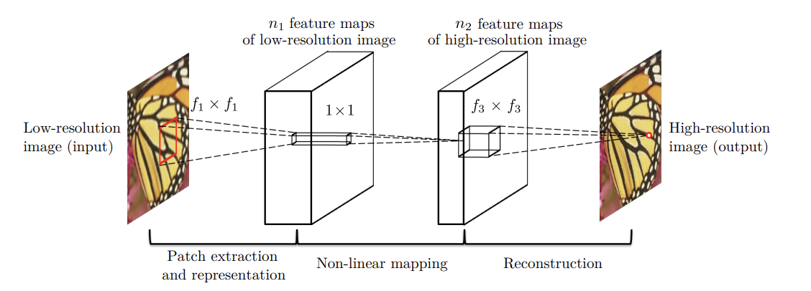
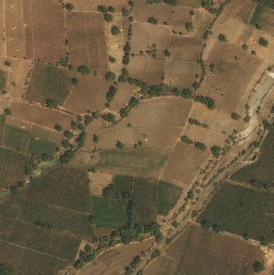
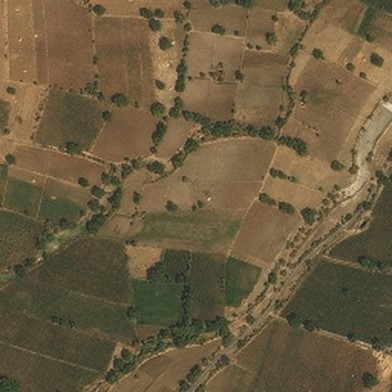

# SRCNN: Super-Resolution Convolutional Neural Network

This repository contains the implementation of the SRCNN (Super-Resolution Convolutional Neural Network) model for image super-resolution.

## Overview

SRCNN is a deep learning model designed to enhance the resolution of low-resolution images by predicting the high-resolution version of the input image. This method is particularly useful in applications where high-quality images are required, such as medical imaging, satellite imaging, and various computer vision tasks.

## Features

- Implementation of the SRCNN architecture.
- Pre-trained models for quick inference.
- Scripts for training the SRCNN model on custom datasets.
- Evaluation metrics for comparing performance with other super-resolution methods.

## Architecture

The SRCNN model consists of three convolutional layers:

1. **Patch extraction and representation**: Extracts overlapping patches from the input image and represents them at a high-dimensional feature space.
2. **Non-linear mapping**: Maps the high-dimensional feature representation to another high-dimensional feature space.
3. **Reconstruction**: Aggregates the high-dimensional features to reconstruct the high-resolution image.

## Results

Example results obtained using the SRCNN model:

| Low-Resolution Image | Super-Resolution Image |
|----------------------|------------------------|
|  |  | 

## References

- [Image Super-Resolution Using Deep Convolutional Networks (ECCV 2014)](https://arxiv.org/abs/1501.00092)
- [Learning a Deep Convolutional Network for Image Super-Resolution (CVPR 2016)](https://ieeexplore.ieee.org/document/7780551)

